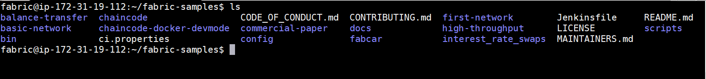
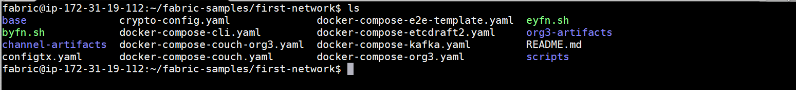

# Build Your First Network (Hyperledger Fabric)

This guide walks you through the intallation of a sample hyperledger fabric in Linux or Windows.

## Prerequisites

This instruction will show how to install each of tool.

- cURL — latest version
- Docker — version 17.06.2-ce or greater
- Docker Compose — version 1.14.0 or greater
- Golang — version 1.11.x
- Nodejs — version 8.x (other versions are not in support yet)
- NPM — version 5.x
- Python 2.7

Before we begin, if you haven’t already done so, you may wish to check that you have all the [prerequisites](PREREQUISITES.md) installed on the platform(s) on which you’ll be developing blockchain applications and/or operating Hyperledger Fabric.

## Linux

Linux installation is pretty straight forward compared to windows. Few commands and Fabric is ready.

This can be done inside vagrant box (ubuntu box). All the instructions will run in the terminal.

### Step 1: Install Samples, Binaries and Docker Images

Determine the directory where you want to download the fabric samples. Open the directory in terminal and run the below command.

``` bash
curl -sSL http://bit.ly/2ysbOFE | bash -s
```

It will download the latest production release.

If you want a specific release for ex. v1.4.1, follow the below command.

``` bash
curl -sSL http://bit.ly/2ysbOFE | bash -s -- <fabric_version> <fabric-ca_version> <thirdparty_version>
curl -sSL http://bit.ly/2ysbOFE | bash -s -- 1.4.1 1.4.1 0.4.15
```

It’ll take some time, once it is finished you can see a new directory “fabric-samples”.

“fabric-samples” come with sample examples to start with Hyperledger Fabric. There are many good examples to play within the fabric samples.



### Step 2: Test the fabric network

As we have successfully completed the setting up the Fabric environment, let’s test it.
To test it we’ll use the first-network sample in the fabric-samples.

Open the fabric-samples and go to the first-network.

``` bash
cd fabric-samples/first-network
```



To test it, run the byfn.sh . It is a test script, it first set up the network with 2 organizations org1 and org2 with 2 peers each and an orderer .

``` bash
./byfn.sh up
```


On successful execution, you’ll see the below message.


If you reach till this point it means you have successfully set up the fabric network.

Now, we have completed the testing of first-network, clean the network.

``` bash
./byfn down
```

Congratulations, we have completed the Hyperledger Fabric installation in Linux machine.

## Windows Installation

For Windows installation, you should be prepared for some obstacles as installation on windows is not easy peasy.

Let's begin the windows installation.

The guide is based on Windows 10 Pro for the Fabric v1.4 installation.

### Step 1: Install Samples, Binaries and Docker Images

Go to the directory where you want to download the fabric samples.

Once you’re in the directory open git bash . Right-click and select Git Bash Here .


Run the below command to install Samples, Binaries and Docker Images

``` bash
curl -sSL http://bit.ly/2ysbOFE | bash -s
```

It will download the latest production release.

If you want a specific release for ex. v1.4.1, follow the below command.

``` bash
curl -sSL http://bit.ly/2ysbOFE | bash -s -- <fabric_version> <fabric-ca_version> <thirdparty_version>
curl -sSL http://bit.ly/2ysbOFE | bash -s -- 1.4.1 1.4.1 0.4.15
```

It’ll take some time, once it is finished you can see a new directory “fabric-samples”.


“fabric-samples” come with sample examples to start with Hyperledger Fabric. There are many good examples to play within the fabric samples.

### Step 2: Test the fabric network

As we have successfully completed the setting up the Fabric environment, it’s time to test it. We are going to use the first-network sample from the fabric-samples.

Open the fabric-samples and go to first-network.

``` bash
cd fabric-samples/first-network
```


To test it, run the byfn.sh . It is a test script, it first setup the network with 2 organizations org1 and org2 with 2 peers each and an orderer .

``` bash
./byfn.sh up
```


On successful execution, you’ll see the below message.


If you reach till this point it means you have successfully setup the fabric network.

Now, we have completed the testing of first-network, clean the network.

``` bash
./byfn down
```

Here, we have completed the Hyperledger Fabric installation in the Windows machine.

Yes, we successfully installed the Fabric on Windows.

## References

[1] https://hyperledger-fabric.readthedocs.io/en/release-1.2/build_network.html

[2] https://hyperledger-fabric.readthedocs.io/en/release-1.4/getting_started.html

[3] https://medium.com/hackernoon/hyperledger-fabric-installation-guide-74065855eca9#c566

[4] https://medium.com/akeo-tech/step-by-step-guide-to-set-up-hyperledger-fabric-network-b80977c29b8a